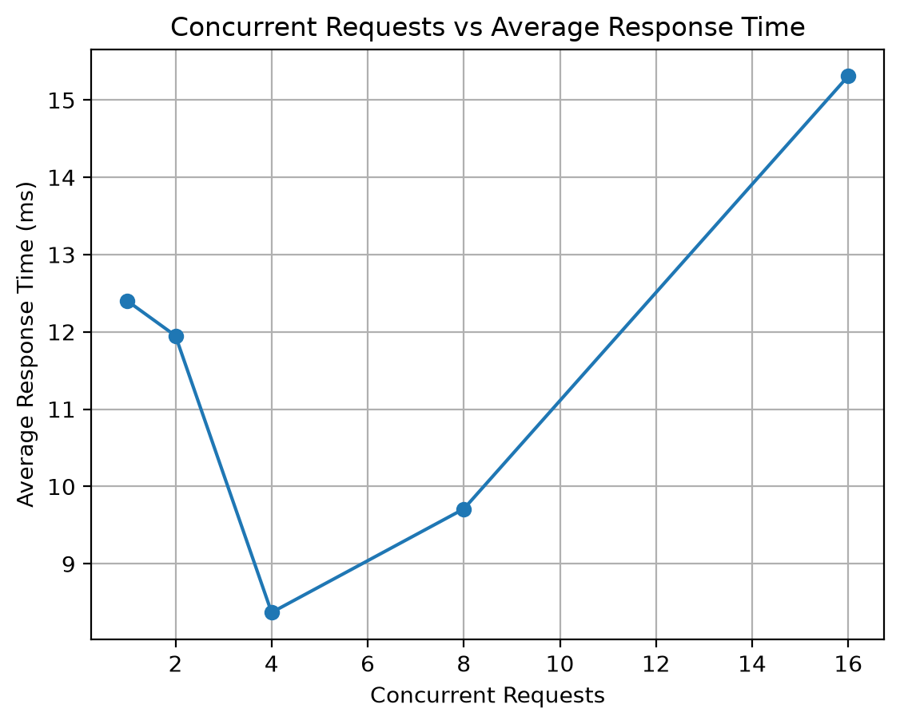
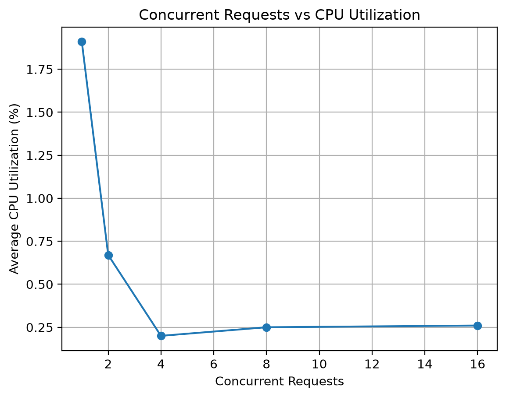
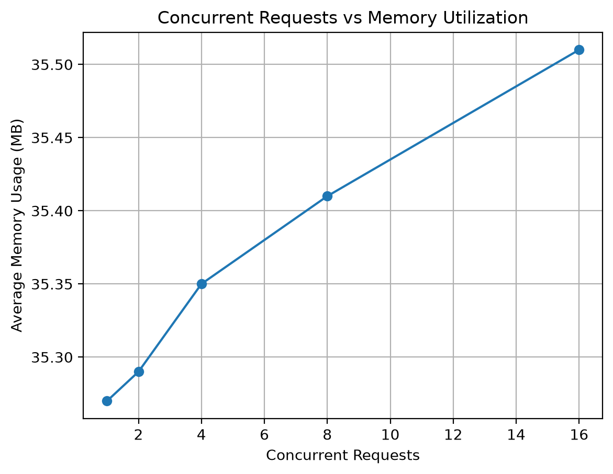
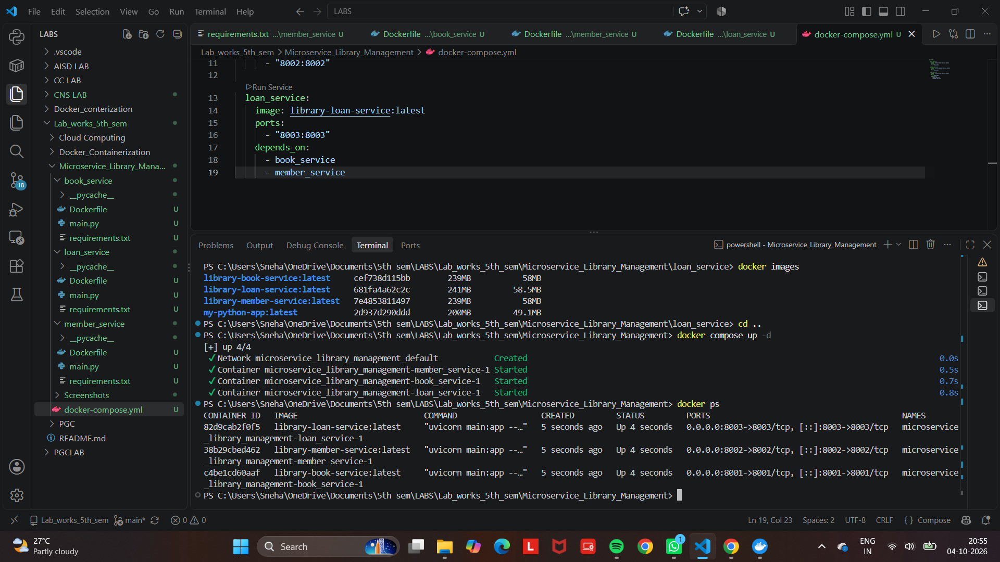
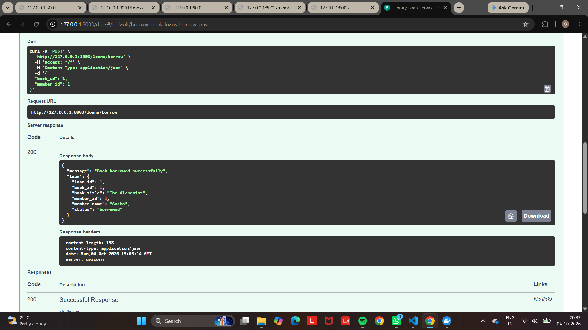
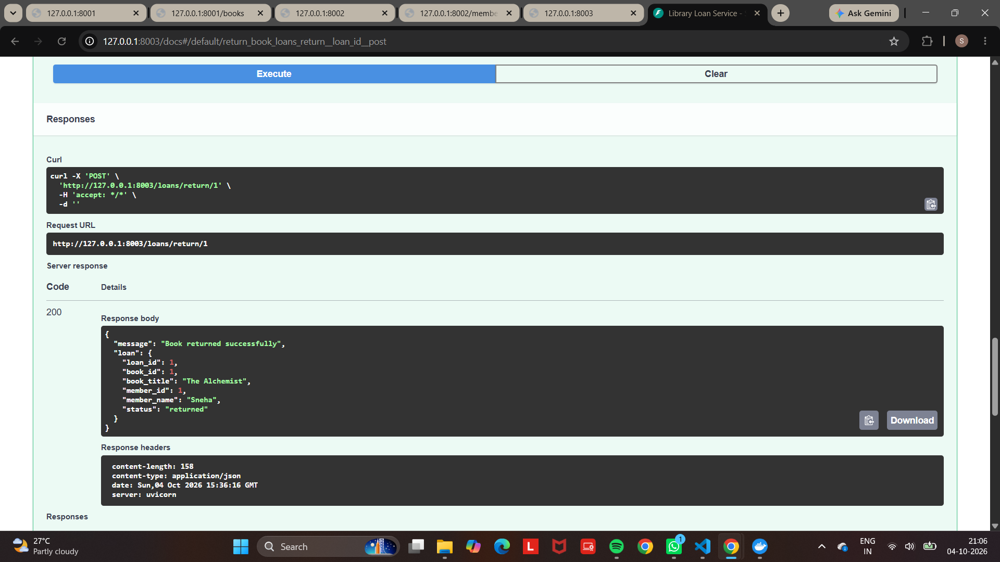
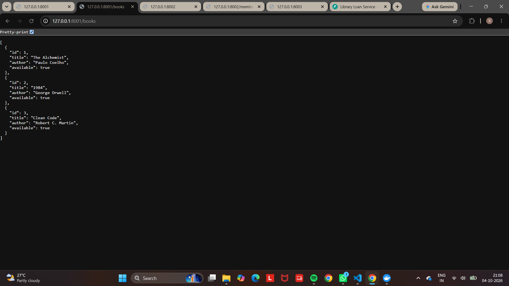

# Library Management System - Microservices

## Overview

This project implements a **Library Management System using a Microservices Architecture**.

The application is divided into three independent microservices:

1. **Book Service** - manages library books and their availability.
2. **Member Service** - manages library member information.
3. **Loan Service** - manages borrowing and returning of books and communicates with the Book Service and Member Service.

Each microservice is independently developed and exposed through REST APIs. The services are containerized using Docker and deployed together using Docker Compose.

**Tech stack:** Python, FastAPI, Docker, Docker Compose

---

## Architecture

The system consists of three independent microservices:

```text
                  Library Management System
                           |
          +----------------+----------------+
          |                |                |
          v                v                v
   +-------------+  +---------------+  +-------------+
   | Book Service|  | Member Service|  | Loan Service|
   |   :8001     |  |    :8002      |  |    :8003    |
   +-------------+  +---------------+  +-------------+
          ^                ^                |
          |                |                |
          +----------------+----------------+
                  Inter-Service Communication
```

### Microservices

| Service | Responsibility | Port |
|---|---|---:|
| Book Service | Book management and availability | 8001 |
| Member Service | Library member management | 8002 |
| Loan Service | Borrowing and returning books | 8003 |

---

## Book Service

The **Book Service** is responsible for managing library books and their availability.

### Responsibilities

- Store and provide book details.
- Retrieve the list of books along with their availability.
- Retrieve details of a specific book.
- Update book availability when a book is borrowed or returned.

### REST Endpoints

| Method | Endpoint | Description |
|---|---|---|
| GET | `/books` | Retrieve all books |
| GET | `/books/{book_id}` | Retrieve a specific book |
| **[FILL IN]** | **[FILL IN]** | Update book availability (called by the Loan Service on borrow and return) |

### Port

The Book Service runs on:

```text
http://localhost:8001
```

---

## Member Service

The **Member Service** is responsible for managing library member information.

### Responsibilities

- Store and provide library member details.
- Retrieve the list of registered members.
- Retrieve details of a specific member.
- Provide member information required during the book borrowing process.

### REST Endpoints

| Method | Endpoint | Description |
|---|---|---|
| GET | `/members` | Retrieve all members |
| GET | `/members/{member_id}` | Retrieve a specific member |

### Port

The Member Service runs on:

```text
http://localhost:8002
```

---

## Loan Service

The **Loan Service** is responsible for managing the borrowing and returning of library books.

### Responsibilities

- Borrow books for registered library members.
- Return borrowed books.
- Maintain loan details and loan status.
- Communicate with the Book Service to verify book availability.
- Communicate with the Member Service to verify member details.

### REST Endpoints

| Method | Endpoint | Description |
|---|---|---|
| GET | `/` | Check Loan Service status |
| GET | `/loans` | Retrieve all loan records |
| POST | `/loans/borrow` | Borrow a book |
| POST | `/loans/return/{loan_id}` | Return a borrowed book |

### Port

The Loan Service runs on:

```text
http://localhost:8003
```

---

## Inter-Service Communication

The **Loan Service** communicates with the **Book Service** and **Member Service** to complete the borrowing process.

When a member requests to borrow a book:

1. The Loan Service receives the borrow request.
2. It communicates with the **Book Service** to verify the book and its availability.
3. It communicates with the **Member Service** to verify the member details.
4. If both are valid, the Loan Service creates the loan record.
5. The book availability is updated after the successful borrowing operation.

### Docker Service Communication

When the services are running using Docker Compose, the Loan Service communicates with the other services using their **Docker Compose service names** instead of `localhost`.

```text
Loan Service
     |
     +----> http://book_service:8001
     |
     +----> http://member_service:8002
```

The following environment variables are used:

```text
BOOK_SERVICE_URL=http://book_service:8001
MEMBER_SERVICE_URL=http://member_service:8002
```

This allows the three microservices to communicate with each other through the Docker Compose network.

---

## Dockerization

Each microservice is containerized using Docker. A separate Dockerfile is provided for each service.

### Docker Images

The following Docker images are created for the application:

| Service | Docker Image | Port |
|---|---|---:|
| Book Service | `library-book-service:latest` | 8001 |
| Member Service | `library-member-service:latest` | 8002 |
| Loan Service | `library-loan-service:latest` | 8003 |

### Docker Compose

Docker Compose is used to build and run all three microservices together.

The services are configured in the `docker-compose.yml` file. Each service has a `build` path (the folder containing its Dockerfile) and an `image` name (the tag given to the built image).

```yaml
services:

  book_service:
    build: ./book_service
    image: library-book-service:latest
    ports:
      - "8001:8001"

  member_service:
    build: ./member_service
    image: library-member-service:latest
    ports:
      - "8002:8002"

  loan_service:
    build: ./loan_service
    image: library-loan-service:latest
    ports:
      - "8003:8003"
    environment:
      BOOK_SERVICE_URL: http://book_service:8001
      MEMBER_SERVICE_URL: http://member_service:8002
    depends_on:
      - book_service
      - member_service
```

### Running the Services

The complete application can be built and started using:

```bash
docker compose up -d --build
```

The running containers can be checked using:

```bash
docker ps
```

All three microservices run as separate Docker containers and communicate through the Docker Compose network.

---

## API Testing and End-to-End Communication

The microservices were tested using REST API requests to verify that the services are working correctly.

### Book Service

The Book Service was tested using:

```text
GET http://localhost:8001/books
```

### Member Service

The Member Service was tested using:

```text
GET http://localhost:8002/members
```

### Loan Service

The Loan Service was tested using:

```text
POST http://localhost:8003/loans/borrow
```

with the following request body:

```json
{
  "book_id": 1,
  "member_id": 1
}
```

The request was successfully processed through the Loan Service, which communicated with the Book Service and Member Service.

### Successful Borrow Operation

The borrow request returned a successful response with:

- Book: The Alchemist
- Member: Sneha
- Status: borrowed
- Response: 200 OK

### Book Return

The borrowed book was returned using:

```text
POST http://localhost:8003/loans/return/1
```

The return operation was successful, and the book became available again in the Book Service.

---

## Performance Testing

The performance of the microservices was evaluated using different workload levels with increasing concurrency.

A total of **5 workload levels** were tested with concurrency levels of **1, 2, 4, 8, and 16**.

### Test Setup

- Requests per workload: **200** (5 workloads x 200 = 1000 requests in total)
- Concurrency levels: 1, 2, 4, 8, 16
- Endpoint under load: **[FILL IN]**
- CPU and memory measured on: **[FILL IN - which container(s)]**
- Load test script: `Performance/load_test.py`

### Workload Results

| Workload | Concurrent Requests | Average Response Time (ms) | Throughput (req/s) | Successful Requests | Failed Requests | Average CPU (%) | Average Memory (MB) |
|---|---:|---:|---:|---:|---:|---:|---:|
| W1 | 1 | 12.40 | 32.45 | 200 | 0 | 1.91 | 35.27 |
| W2 | 2 | 11.95 | 48.16 | 200 | 0 | 0.67 | 35.29 |
| W3 | 4 | 8.37 | 54.05 | 200 | 0 | 0.20 | 35.35 |
| W4 | 8 | 9.71 | 48.12 | 200 | 0 | 0.25 | 35.41 |
| W5 | 16 | 15.31 | 47.97 | 200 | 0 | 0.26 | 35.51 |

### Performance Summary

- Total requests tested: **1000** (200 per workload)
- Successful requests: **1000**
- Failed requests: **0**
- Lowest average response time: **8.37 ms** at concurrency 4.
- Highest throughput: **54.05 requests/second** at concurrency 4.
- Average memory usage remained approximately **35 MB** across the workloads.
- CPU utilization remained low during the tests.

### Performance Graphs

The following graphs were generated from the workload test results.

#### Concurrent Requests vs Average Response Time



#### Concurrent Requests vs Throughput


#### Concurrent Requests vs CPU Utilization



#### Concurrent Requests vs Memory Utilization



The detailed performance results are available in:

`Performance/performance_results.csv`

---

## Performance Analysis

The workload testing results show that the system handled all tested concurrency levels successfully.

### Observations

- All **1000 requests** were completed successfully with **0 failures**.
- Average response time fell from 12.40 ms at concurrency 1 to its lowest value of **8.37 ms** at concurrency 4, then rose to 9.71 ms at concurrency 8 and **15.31 ms** at concurrency 16.
- Throughput peaked at **54.05 requests/second** at concurrency 4 and was about 48 requests/second at concurrency 2, 8 and 16, so adding concurrency beyond 4 did not improve throughput.
- CPU utilization remained low in every workload (at most 1.91%).
- Memory utilization remained nearly stable at approximately **35 MB** (35.27 MB to 35.51 MB).

### Performance Conclusion

All five workloads completed with 100% request success. In these tests, concurrency 4 gave the best result, with the lowest response time and the highest throughput. Beyond concurrency 4, response time grew while throughput settled at about 48 requests/second.

---

## Screenshots

The following screenshots provide evidence of the Docker deployment, running containers, inter-service communication, and successful API operations.

### Docker Images and Containers





### End-to-End Communication







---

## Project Structure

The project is organized as follows:

```text
01 - Microservice_Library_Management/
│
├── book_service/
│   ├── Dockerfile
│   ├── main.py
│   └── requirements.txt
│
├── member_service/
│   ├── Dockerfile
│   ├── main.py
│   └── requirements.txt
│
├── loan_service/
│   ├── Dockerfile
│   ├── main.py
│   └── requirements.txt
│
├── Performance/
│   ├── load_test.py
│   ├── performance_results.csv
│   ├── performance_observation_table.csv
│   ├── response_time.png
│   ├── throughput.png
│   ├── cpu_utilization.png
│   └── memory_utilization.png
│
├── Screenshots/
│   ├── 01_three_microservices_running.png
│   ├── 02_all_three_docker_images.png
│   ├── 03_all_three_containers_running.png
│   ├── 04_end_to_end_borrow.png
│   ├── 05_book_service_docker_image.png
│   ├── 06_book_and_member_docker_images.png
│   ├── 07_all_three_docker_images.png
│   ├── 08_three_containers_running.png
│   ├── 09_docker_compose_services_running.png
│   ├── 10_book_return_success.png
│   └── 11_book_available_after_return.png
│
├── docker-compose.yml
└── README.md
```

---

## How to Run the Project

### Prerequisites

Docker with Docker Compose v2 (the `docker compose` command) installed and running.

### Step 1: Build and Start the Docker Services

Open a terminal in the project directory and run:

```bash
docker compose up -d --build
```

### Step 2: Check Running Containers

```bash
docker ps
```

You should see three containers, one for each service (`book_service`, `member_service`, `loan_service`), with status `Up`. Docker Compose adds the project name as a prefix to the container names.

### Step 3: Test the Services

```text
Book Service:    GET http://localhost:8001/books
Member Service:  GET http://localhost:8002/members
Loan Service:    GET http://localhost:8003/
```

### Step 4: Stop the Services

To stop the application:

```bash
docker compose down
```

---

## Conclusion

The Library Management System was successfully implemented using a **Microservices Architecture** consisting of three independent services: **Book Service, Member Service, and Loan Service**.

The project demonstrates:

- Independent REST APIs for each microservice.
- Dockerization of all three microservices.
- Deployment using Docker Compose.
- Inter-service communication using Docker service names.
- Successful book borrowing and returning operations.
- Successful execution of workload testing at five different concurrency levels.
- Performance monitoring of response time, throughput, CPU utilization, and memory utilization.

The system achieved **100% request success** during the performance testing, demonstrating that the microservices were able to handle the tested workloads successfully.

---

## References

- Microservice Lab Evaluation Manual
- [FastAPI Documentation](https://fastapi.tiangolo.com/)
- [Docker Documentation](https://docs.docker.com/)
- [Docker Compose Documentation](https://docs.docker.com/compose/)

---

## Author

**Sneha Shettar**

5th Semester – Cloud Computing Lab

[KLE TECHNOLGICAL UNIVERSITY]