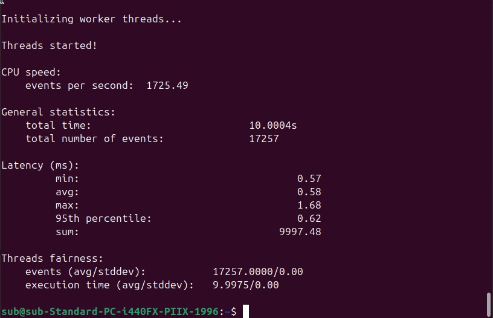
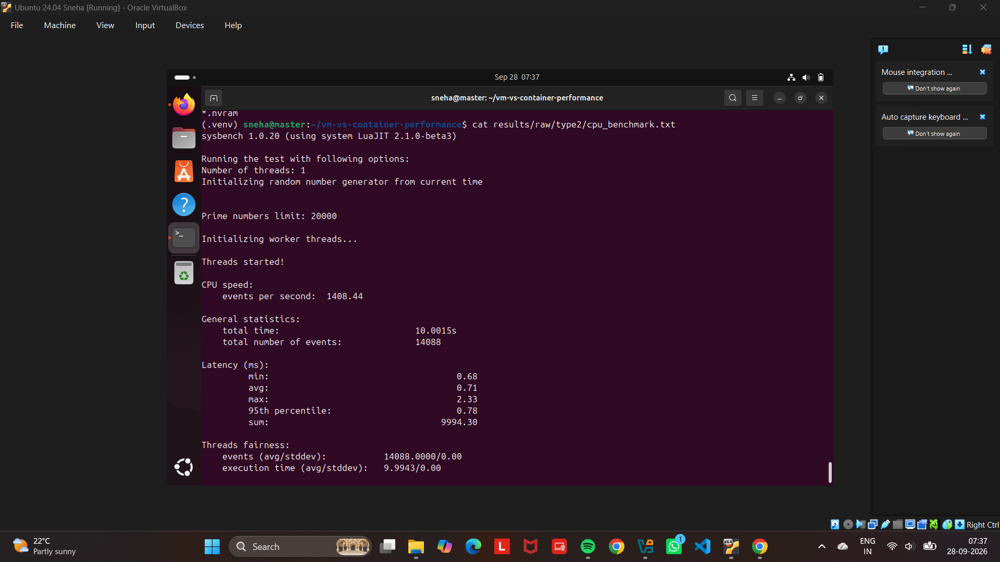
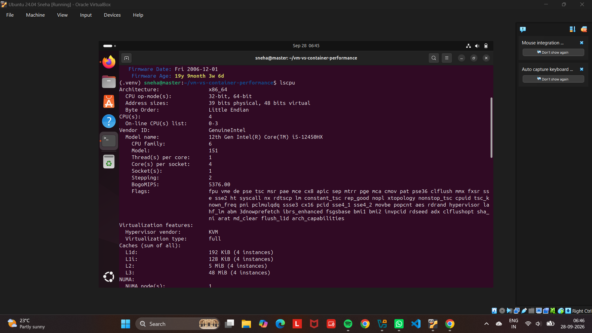
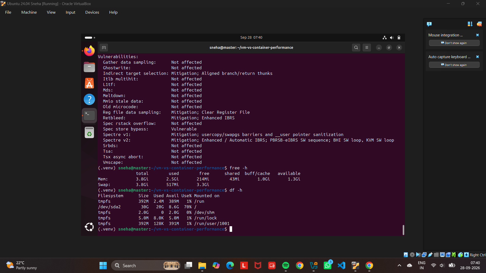
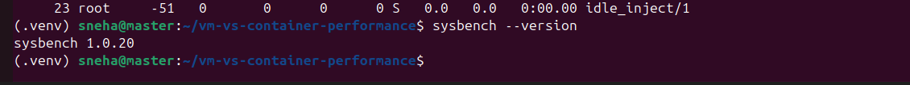

# Performance Analysis of Type-1 and Type-2 Hypervisors

## Title

**Performance Analysis of Type-1 and Type-2 Hypervisors**

---

# Problem Statement

Virtualization enables multiple virtual machines to run on a common physical computing system.

A hypervisor is responsible for creating and managing virtual machines and allocating physical computing resources such as CPU, memory, storage, and network resources to them.

Hypervisors can be broadly classified into two types:

- **Type-1 Hypervisor** — runs directly on the physical hardware.
- **Type-2 Hypervisor** — runs on top of a host operating system.

This experiment studies the configuration and performance of virtual machines using Type-1 and Type-2 hypervisor environments.

The virtual machines are configured with comparable resources and their CPU performance is measured using Sysbench. The obtained results are then recorded and compared using tables and graphs.

---

# Objective

The objectives of this experiment are:

- To understand the concept of hypervisors.
- To study Type-1 and Type-2 hypervisors.
- To create and configure virtual machines.
- To configure CPU, memory, storage, and network resources.
- To verify the virtual machine system configuration.
- To monitor virtual machine resource utilization.
- To install and use Sysbench.
- To perform CPU performance benchmarking.
- To record the benchmark results.
- To compare the measured performance of Type-1 and Type-2 hypervisors.
- To represent the comparison using tables and graphs.

---

# Type-1 Hypervisor

## Hypervisor Used

**Proxmox VE**

Proxmox VE is used as the Type-1 hypervisor for this experiment.

The virtual machine is created and managed through the Proxmox VE web interface.

---

## Type-1 Setup

The virtual machine was configured with the following resources:

| Parameter | Configuration |
|---|---|
| Hypervisor | Proxmox VE |
| Hypervisor Type | Type-1 |
| Guest Operating System | Ubuntu |
| CPU | 2 vCPU |
| Memory | 2 GB |
| Disk | 20 GB |
| Network | vmbr0 |

The laboratory procedure specifies a VM configuration of 2 vCPU, 2 GB memory and a 20 GB virtual disk for the Type-1 experiment. :chatgpt-content-reference{index="4"} :chatgpt-content-reference{index="5"}

---

## Type-1 Procedure

The following procedure was followed:

1. Access the Proxmox VE web interface.
2. Select the Proxmox node.
3. Open the Create VM wizard.
4. Configure the general VM settings.
5. Select the Ubuntu ISO image.
6. Configure the virtual disk.
7. Allocate CPU resources.
8. Allocate memory.
9. Configure the network interface.
10. Confirm and create the virtual machine.
11. Start the virtual machine.
12. Open the VM console.
13. Install Ubuntu.
14. Verify the VM configuration.
15. Install Sysbench.
16. Execute the CPU benchmark.
17. Monitor resource utilization.
18. Record the benchmark results.

The Proxmox workflow and VM creation sequence are documented in the laboratory manual. :chatgpt-content-reference{index="6"} :chatgpt-content-reference{index="7"}

---

# Type-1 Screenshots

## 1. Proxmox VE Dashboard


The screenshot shows the Proxmox VE management interface used for managing the virtual machine environment.

---

## 2. Proxmox VM Configuration


This screenshot shows the configuration of the virtual machine in Proxmox VE.

---

## 3. Proxmox VM Running


This screenshot shows the virtual machine in its running state.

---

## 4. Ubuntu Console


The Ubuntu console is used to access the guest operating system and execute the required system and benchmark commands.

---

## 5. System Configuration


This screenshot records the system configuration observed inside the virtual machine.

---

## 6. Result Configuration



This screenshot records the relevant result/configuration information obtained during the Type-1 experiment.

---

# Type-1 Performance Benchmark

Sysbench was used to perform CPU performance analysis.

The benchmark command was:

```bash
sysbench cpu --cpu-max-prime=20000 run
```

The following measurements were recorded:

- Total execution time
- Total number of events
- Events per second
- Minimum latency
- Average latency
- Maximum latency

The laboratory manual specifies the Sysbench CPU workload and the performance values to be recorded. :chatgpt-content-reference{index="8"}

---

## Type-1 Results

| Parameter | Observation |
|---|---|
| Hypervisor | Proxmox VE |
| Hypervisor Type | Type-1 |
| Guest Operating System | Ubuntu |
| CPU Allocation | 2 vCPU |
| Memory Allocation | 2 GB |
| Disk Allocation | 20 GB |
| Total Execution Time | **[ENTER ACTUAL VALUE]** |
| Total Events | **[ENTER ACTUAL VALUE]** |
| Events per Second | **[ENTER ACTUAL VALUE]** |
| Minimum Latency | **[ENTER ACTUAL VALUE]** |
| Average Latency | **[ENTER ACTUAL VALUE]** |
| Maximum Latency | **[ENTER ACTUAL VALUE]** |

---

# Type-2 Hypervisor

## Hypervisor Used

**Oracle VirtualBox**

The Type-2 experiment documented in this repository was performed using Oracle VirtualBox.

> **Note:** The supplied laboratory manual describes VMware Workstation as its Type-2 example, while the actual experiment screenshots in this repository are from Oracle VirtualBox. This README documents the environment actually used for the experiment.

---

## Type-2 Setup

The Type-2 virtual machine was configured to provide a comparable environment to the Type-1 virtual machine.

| Parameter | Configuration |
|---|---|
| Hypervisor | Oracle VirtualBox |
| Hypervisor Type | Type-2 |
| Guest Operating System | Ubuntu |
| CPU | 2 vCPU |
| Memory | 2 GB |
| Disk | 20 GB |
| Network | **[ENTER ACTUAL CONFIGURATION]** |

---

## Type-2 Procedure

The following procedure was followed:

1. Open Oracle VirtualBox.
2. Create a new virtual machine.
3. Select the Ubuntu installation image.
4. Configure the virtual machine hardware.
5. Allocate CPU resources.
6. Allocate memory.
7. Configure virtual storage.
8. Configure the network.
9. Start the virtual machine.
10. Install Ubuntu.
11. Verify CPU configuration.
12. Verify memory configuration.
13. Verify disk configuration.
14. Monitor system resources.
15. Install Sysbench.
16. Run the CPU benchmark.
17. Record the benchmark results.

---

# Type-2 Screenshots

The `TYPE-2/` directory contains the screenshots collected during the Oracle VirtualBox experiment.

The evidence currently includes screenshots covering:

- CPU benchmark
- CPU configuration
- Memory and storage configuration
- Resource monitoring
- Sysbench version
- System configuration
- Benchmark/result information

### Type-2 CPU Benchmark



### Type-2 CPU Configuration



### Type-2 Memory and Storage



### Type-2 Resource Monitoring

> Add the exact filename of the resource-monitoring screenshot here.

### Type-2 Sysbench Version



### Type-2 System Configuration

> Add the exact filename of the system-configuration screenshot here.

---

# Type-2 Performance Benchmark

The same CPU workload was used for the Type-2 environment:

```bash
sysbench cpu --cpu-max-prime=20000 run
```

The following measurements were recorded:

- Total execution time
- Total number of events
- Events per second
- Minimum latency
- Average latency
- Maximum latency

---

## Type-2 Results

| Parameter | Observation |
|---|---|
| Hypervisor | Oracle VirtualBox |
| Hypervisor Type | Type-2 |
| Guest Operating System | Ubuntu |
| CPU Allocation | 2 vCPU |
| Memory Allocation | 2 GB |
| Disk Allocation | 20 GB |
| Total Execution Time | **[ENTER ACTUAL VALUE]** |
| Total Events | **[ENTER ACTUAL VALUE]** |
| Events per Second | **[ENTER ACTUAL VALUE]** |
| Minimum Latency | **[ENTER ACTUAL VALUE]** |
| Average Latency | **[ENTER ACTUAL VALUE]** |
| Maximum Latency | **[ENTER ACTUAL VALUE]** |

---

# Performance Comparison

The Type-1 and Type-2 results are compared using the measurements obtained from the Sysbench CPU benchmark.

Both environments were configured with comparable virtual machine resources.

---

## Comparison Table

| Performance Metric | Type-1 — Proxmox VE | Type-2 — Oracle VirtualBox |
|---|---:|---:|
| Hypervisor Type | Type-1 | Type-2 |
| CPU Allocation | 2 vCPU | 2 vCPU |
| Memory Allocation | 2 GB | 2 GB |
| Disk Allocation | 20 GB | 20 GB |
| Total Execution Time | **[VALUE]** | **[VALUE]** |
| Total Events | **[VALUE]** | **[VALUE]** |
| Events per Second | **[VALUE]** | **[VALUE]** |
| Minimum Latency | **[VALUE]** | **[VALUE]** |
| Average Latency | **[VALUE]** | **[VALUE]** |
| Maximum Latency | **[VALUE]** | **[VALUE]** |

### Interpretation

The table presents the actual benchmark measurements obtained from both hypervisor environments.

The measurements should be interpreted using the same workload and configuration conditions. No performance conclusion should be made from the hypervisor type alone; the recorded benchmark results are used as the basis for the comparison.

---

# Comparison Graph

The comparison graph generated from the recorded benchmark results is stored in:

`Comparison graphs/hypervisor-performance-comparison.png`


The graph provides a visual comparison of the measured Type-1 and Type-2 performance results.

---

# Observations

The following parameters are considered during the comparison:

- Total execution time
- Total benchmark events
- Events per second
- Minimum latency
- Average latency
- Maximum latency

The benchmark values should be compared using the same workload configuration for both environments.

---

# Conclusion

The experiment provided practical experience with Type-1 and Type-2 hypervisor environments.

Virtual machines were configured with comparable resources, system configurations were verified, CPU performance was measured using Sysbench, and the obtained measurements were recorded.

The final comparison is based on the actual benchmark results collected during the experiment.

---

# Author

**Name:** [Sneha Shettar]